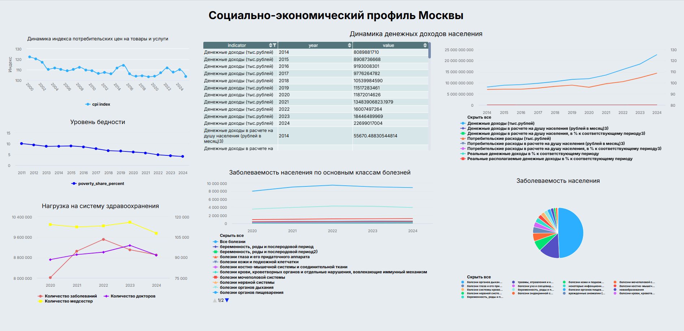

# 📊 Mosstat Analytics Service

Проект представляет собой полноценный аналитический сервис для автоматизированной работы со статистическими данными Мосстата по Москве.

Сервис реализует полный цикл обработки данных:

**ETL → PostgreSQL → REST API → Графический интерфейс**

---

## 📌 Возможности проекта

Сервис автоматически:

- 📥 Скачивает актуальные данные с официального сайта Мосстата  
- 🔄 Предобрабатывает Excel-файлы  
- 🗄 Загружает данные в PostgreSQL (с поддержкой обновления)  
- 🌐 Предоставляет REST API  
- 🖥 Отображает таблицы и расчёты через удобный интерфейс (Streamlit)  

---

## 📈 Доступные показатели

Пользователь может получить:

### 1️⃣ Индекс потребительских цен (ИПЦ)
- помесячная динамика
- расчёт ИПЦ за произвольный период
- расчёт годового ИПЦ по формуле произведения индексов

### 2️⃣ Денежные доходы населения Москвы
- номинальные доходы
- реальные располагаемые доходы
- доходы на душу населения
- потребительские расходы

### 3️⃣ Уровень бедности
- доля населения с доходами ниже прожиточного минимума

### 4️⃣ Заболеваемость по классам болезней
- "Все болезни"
- новообразования
- инфекционные и паразитарные заболевания
- и другие классы

### 5️⃣ Численность медицинских кадров
- численность врачей всего
- численность врачей на 10 000 населения
- численность среднего медицинского персонала

---

## 🛠 Используемые технологии

### Backend
- Python 3
- FastAPI
- Pydantic
- SQLAlchemy / psycopg2
- Pandas
- Requests
- OpenPyXL
- BeautifulSoup

### База данных
- PostgreSQL
- UPSERT (ON CONFLICT DO UPDATE)
- Нормализованная структура таблиц

### Frontend
- Streamlit
- Кэширование (`st.cache_data`)
- Обработка пользовательских ошибок
- Динамическое обновление списков показателей

---

## 🗄 Структура базы данных

В PostgreSQL создаются таблицы:

- `mosstat_cpi`
- `mosstat_income`
- `mosstat_poverty`
- `mosstat_morbidity`
- `mosstat_medstaff`

Загрузка данных реализована через UPSERT, что позволяет безопасно обновлять данные при повторном выполнении ETL.

---

## 📂 Дополнительная часть проекта — Cubisio

В папке проекта находится директория:

ff39b03eb6fb0b9f34272be9c8a78063


Это отдельная часть проекта, реализованная в **Cubisio**.

В Cubisio реализовано:

- 🔌 Подключение к PostgreSQL  
- 📊 Дашборд по ключевым показателям  
- Интерактивная визуализация данных из базы  

Таким образом, проект имеет два интерфейса работы с данными:
1. Программный (через API)
2. BI-дашборд (Cubisio)

---

## 📊 Изображение дашборда (Cubisio)



---

## 🚀 Как запустить проект

### 1️⃣ Запуск backend (FastAPI)

```bash
uvicorn backend.main:app --reload --host 127.0.0.1 --port 8000
```

### 2️⃣ Запуск frontend (Streamlit)

```bash
streamlit run frontend/app.py
```